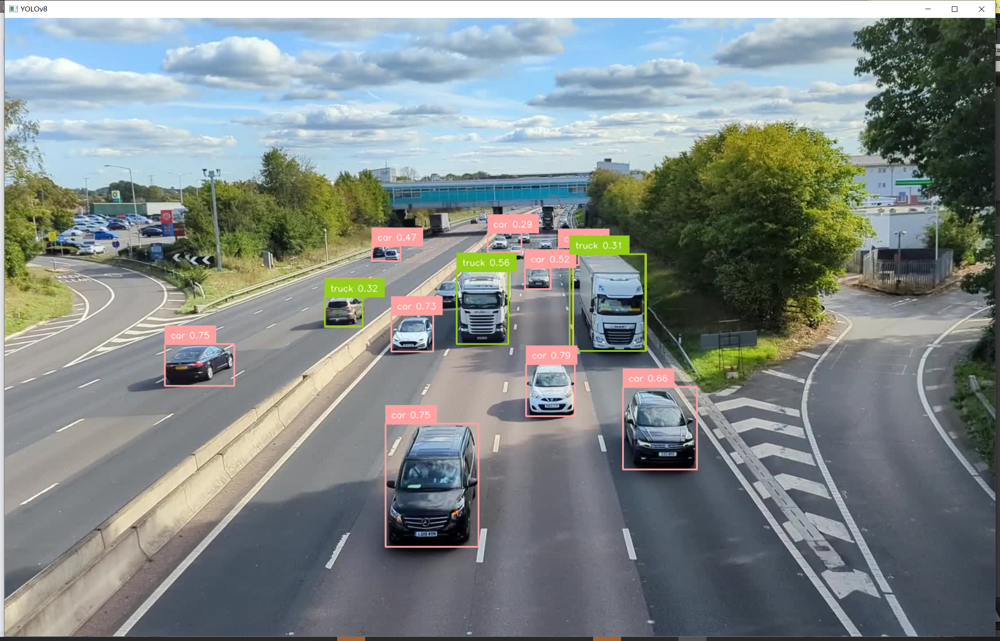
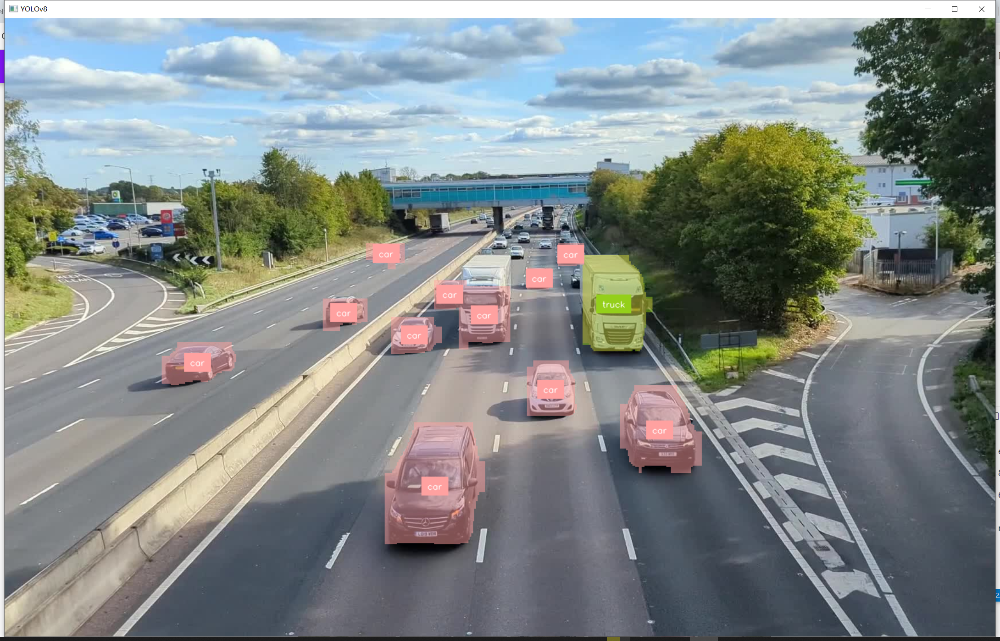

## 使用Box和Label标记图片物体

官方文档 `https://supervision.roboflow.com/latest/how_to/detect_and_annotate/`

可以对物体用线框和Label进行标注，如下图：



```python
#file:files\supervision\detect_and_annotate.py

import cv2
import supervision as sv
from ultralytics import YOLO

model = YOLO("yolov8n.pt")
image = cv2.imread("highway_traffic.png")
results = model(image)[0]
detections = sv.Detections.from_ultralytics(results)

box_annotator = sv.BoxAnnotator()
label_annotator = sv.LabelAnnotator()

labels = [
    f"{class_name} {confidence:.2f}"
    for class_name, confidence
    in zip(detections['class_name'], detections.confidence)
]

annotated_image = box_annotator.annotate(
    scene=image, detections=detections)
annotated_image = label_annotator.annotate(
    scene=annotated_image, detections=detections, labels=labels)

cv2.imshow("YOLOv8", annotated_image)
cv2.waitKey(0)
```

也可以将物体用色块进行标注，如下图：



```python
#file:files\supervision\detect_and_annotate_segmentations.py

import cv2
import supervision as sv
from ultralytics import YOLO

model = YOLO("yolov8n-seg.pt")
image = cv2.imread("highway_traffic.png")
results = model(image)[0]
detections = sv.Detections.from_ultralytics(results)

mask_annotator = sv.MaskAnnotator()
label_annotator = sv.LabelAnnotator(text_position=sv.Position.CENTER_OF_MASS)

annotated_image = mask_annotator.annotate(
    scene=image, detections=detections)
annotated_image = label_annotator.annotate(
    scene=annotated_image, detections=detections)

cv2.imshow("YOLOv8", annotated_image)
cv2.waitKey(0)
```