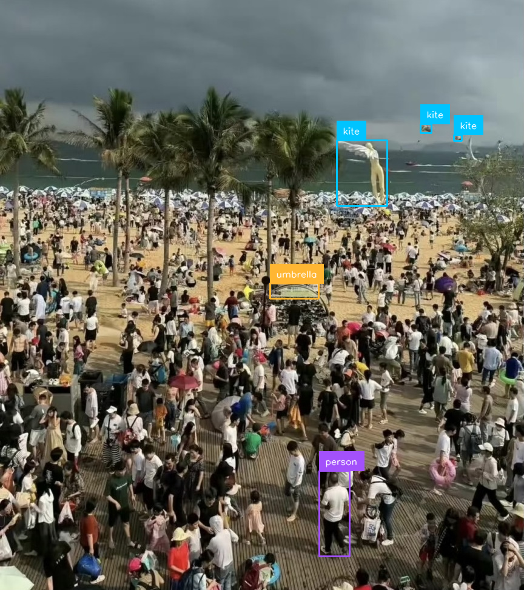
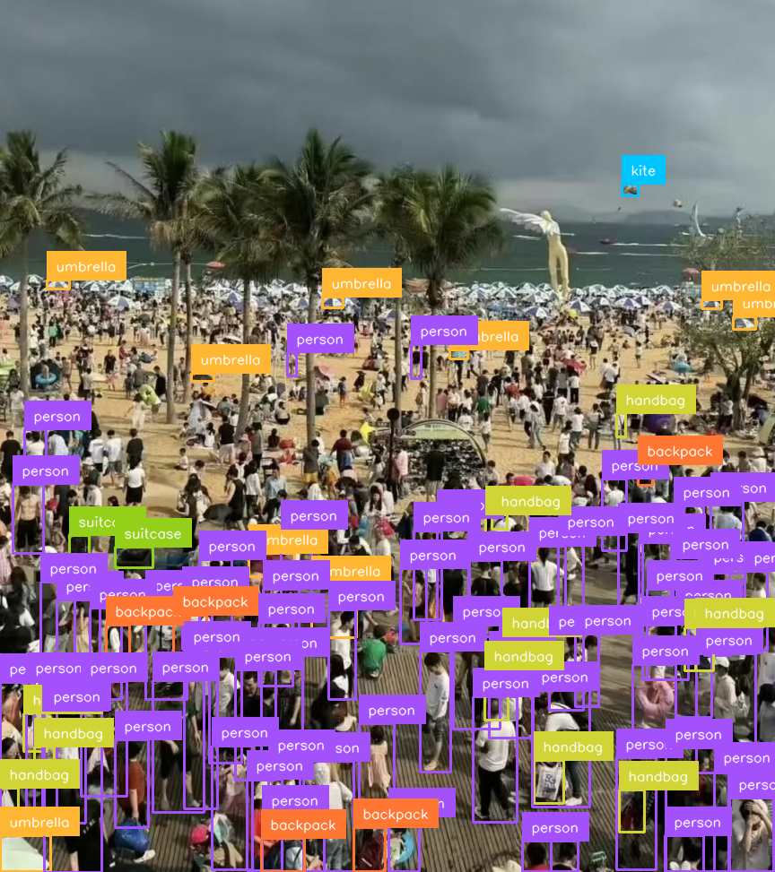
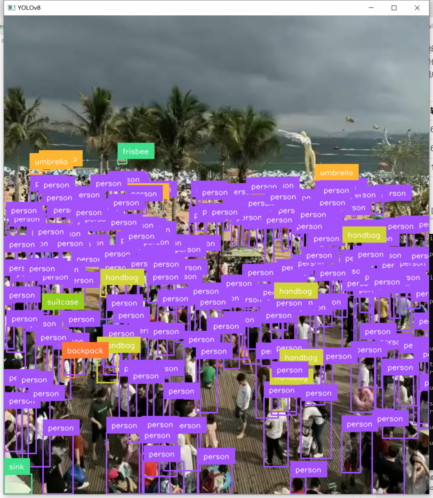

## 检测小物体

小物体在图片上占的比例很小，很难检测到。

检测小物体需将模型从yolov8n.pt换成yolov8x.pt。

YOLOv8n.pt​​（Nano）：是系列中最轻量级的模型，参数量仅 ​​3.2M​​，网络层数较少，适合资源受限的环境（如移动端或嵌入式设备）

​​YOLOv8x.pt​​（Extra Large）：是最大的版本，参数量高达 ​​68.2M​​，网络结构更深且复杂，能够捕捉更细粒度的特征，但需要更强的计算资源支持

### 基础检测（Baseline Detection）

```python
#file:files\supervision\detect_small_objects.py

import cv2
import supervision as sv
from ultralytics import YOLO

model = YOLO("yolov8x.pt")
image = cv2.imread("small_objects.jpeg")
results = model(image)[0]
detections = sv.Detections.from_ultralytics(results)

box_annotator = sv.BoxAnnotator()
label_annotator = sv.LabelAnnotator()

annotated_image = box_annotator.annotate(
    scene=image, detections=detections)
annotated_image = label_annotator.annotate(
    scene=annotated_image, detections=detections)

# 保存处理后的图像（文件路径可自定义）
cv2.imwrite("detect_small_objects.png", annotated_image)

cv2.imshow("YOLOv8", annotated_image)
cv2.waitKey(0)
```

基础检测效果特别差，小物体几乎检测不到，可以看到图里几百个人，就检测到一个。



### 提升输入分辨率

在读取图片时，指定更大的尺寸，可以达到更好的检测效果。

```python
image = cv2.imread("small_objects.jpeg")
results = model(image, imgsz=640 * 4)[0] # 将图像放大4倍
```

原因是YOLO模型在训练时通常使用固定的输入分辨率，比如640x640。

当输入的图像尺寸与训练时的尺寸不一致时，模型会自动将图像缩放到这个固定尺寸。这可能导致小物体在缩放过程中丢失细节，从而影响检测效果。

将imgsz设置为更大的值，比如1280，模型在推理时会使用更大的输入尺寸，这样在缩放过程中保留更多的细节，有助于小物体的检测。

YOLO在推理时会将输入图像调整为imgsz指定的尺寸，保持长宽比并进行填充。

例如，如果原始图像是4000x3000，设置imgsz=1280会将图像缩放为（1280 * (3000/4000)) ≈ 960，然后填充到1280x1280。这样虽然图像被放大，但相对于直接缩放到640，保留了更多的小物体细节。

用户可能认为imgsz应该设置为图片的实际分辨率，但实际上，YOLO的设计是通过缩放和填充来处理不同尺寸的输入。

因此，imgsz不需要等于原图分辨率，而是模型处理时的目标尺寸。

较大的imgsz可以保留更多细节，但会增加计算量和内存消耗。

还需要提到默认情况下，YOLO使用训练时的分辨率（如640），所以当处理高分辨率图像时，直接使用默认设置可能导致小物体难以检测。

通过增加imgsz，用户可以在不重新训练模型的情况下提升检测效果，尤其是在处理高分辨率图像时。

最后，可能需要给出实际应用中的权衡，比如更大的imgsz会提升检测效果但降低推理速度，建议根据硬件条件和需求调整参数。同时提醒用户，过大的imgsz可能导致显存不足，需要合理选择。


| 模型版本 | 输入尺寸 | 最小检测像素 | 感受野直径 |
| :------- | :------- | :----------- | :--------- |
| YOLOv8n  | 640      | 8×8          | 350px      |
| YOLOv8x  | 640      | 12×12        | 420px      |
| YOLOv8x  | 1280     | 24×24        | 840px      |

表格说明：
- ​模型版本​​：区分不同规模网络结构
- ​输入尺寸​​：模型实际接收的图像尺寸（单位：像素）
- ​最小检测像素​​：能被网络识别的最小物体像素尺寸（宽×高）
- ​感受野直径​​：单个神经元对应的原始图像区域（理论最大值）

```python
#file:files\supervision\detect_small_objects_up_resolution.py

import cv2
import supervision as sv
from ultralytics import YOLO

model = YOLO("yolov8x.pt")
image = cv2.imread("small_objects.jpeg")
results = model(image, imgsz=640 * 4)[0] # 将图像放大4倍
detections = sv.Detections.from_ultralytics(results)

box_annotator = sv.BoxAnnotator()
label_annotator = sv.LabelAnnotator()

annotated_image = box_annotator.annotate(
    scene=image, detections=detections)
annotated_image = label_annotator.annotate(
    scene=annotated_image, detections=detections)

# 保存处理后的图像（文件路径可自定义）
cv2.imwrite("detect_small_objects_up_resolution.png", annotated_image)

cv2.imshow("YOLOv8", annotated_image)
cv2.waitKey(0)
```



改为放大8倍

```python
results = model(image, imgsz=640 * 4)[0] # 将图像放大4倍
detections = sv.Detections.from_ultralytics(results)
```



放大倍数越高，能检测到的物体就更多了，但是处理事件也更长。

