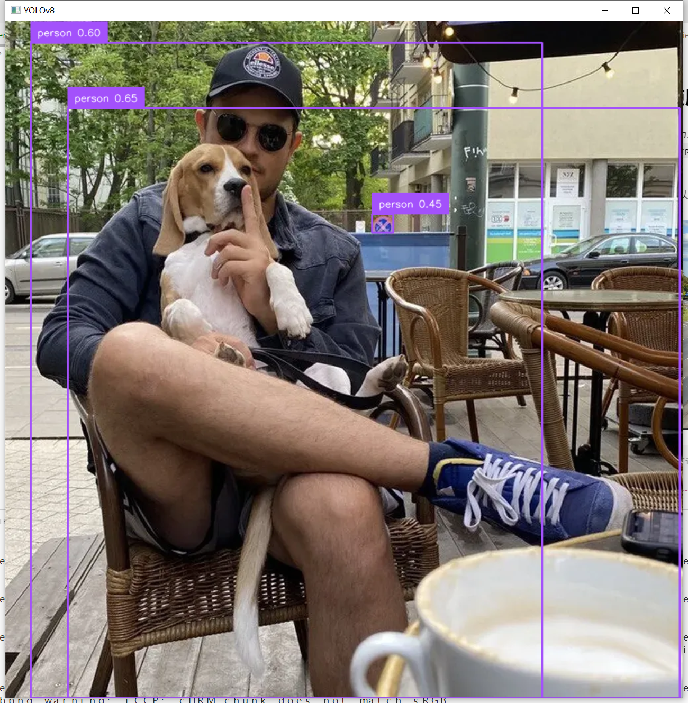
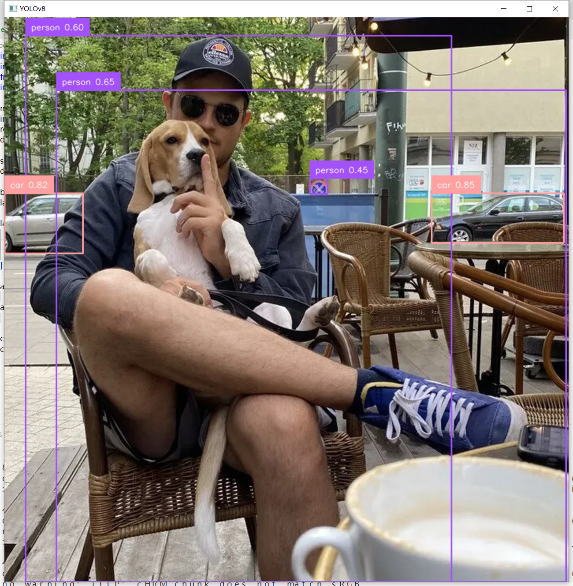
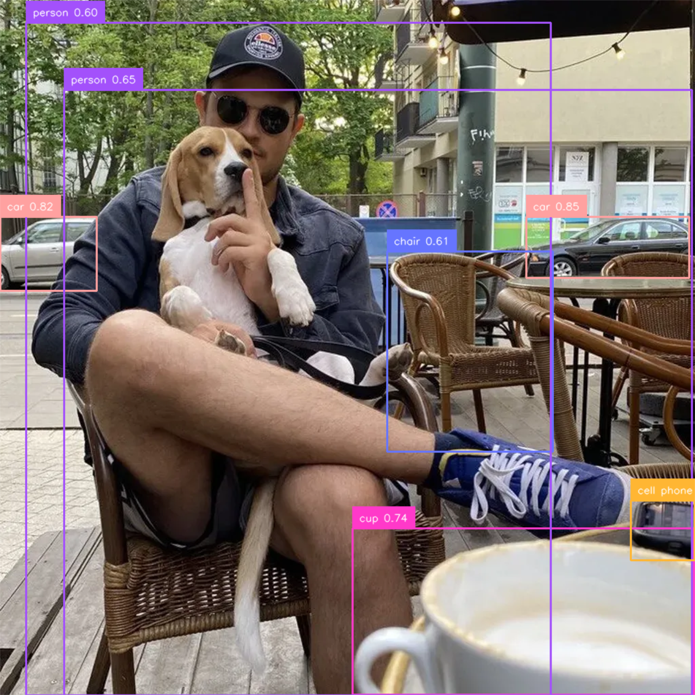
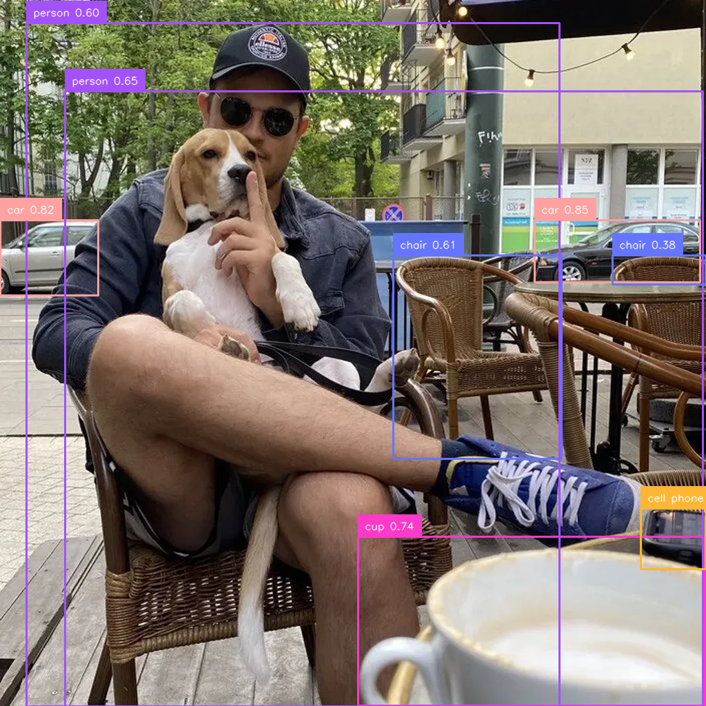
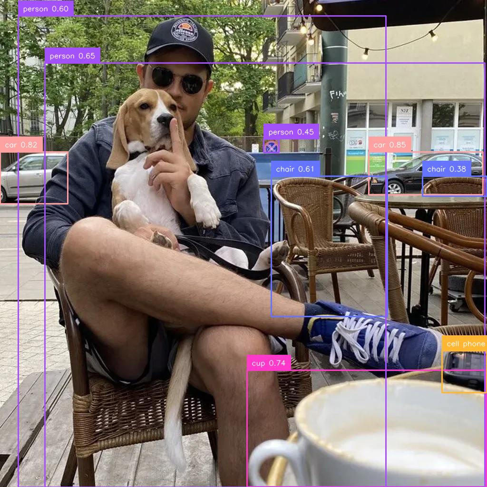
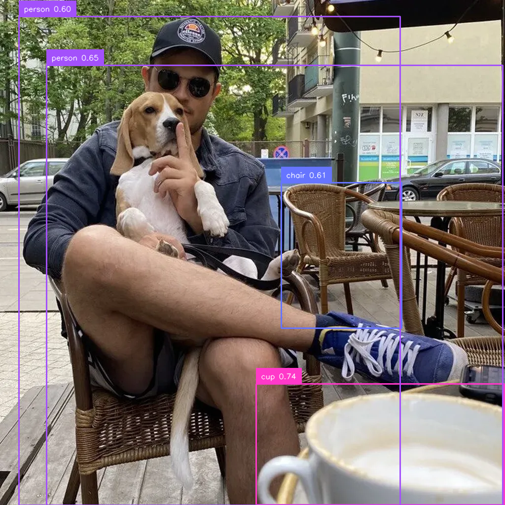
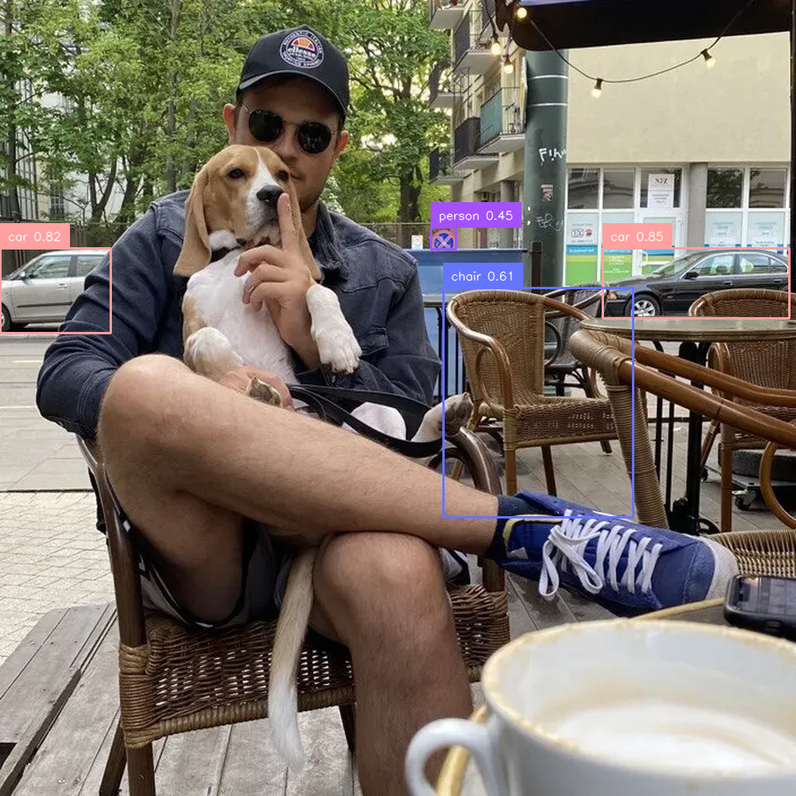

## 过滤检测结果

可以过滤识别的物体类型、也可以选择指定图像区域、也可以按物体像素占比来过滤，或者混合多种条件过滤。

可以用来节省性能开销。


### 按物体类型过滤

下面代码过滤出人，进行标注。

```python
#file:files\supervision\detect_and_annotate_by_specific_class.py

import cv2
import supervision as sv
from ultralytics import YOLO

model = YOLO("yolov8n.pt")
image = cv2.imread("supervision-detection-by-specific.png")
results = model(image)[0]
detections = sv.Detections.from_ultralytics(results)
detections = detections[detections.class_id == 0]#只处理特定类别，这里是0类，即person类

box_annotator = sv.BoxAnnotator()
label_annotator = sv.LabelAnnotator()

labels = [
    f"{class_name} {confidence:.2f}"
    for class_name, confidence
    in zip(detections['class_name'], detections.confidence)
]

annotated_image = box_annotator.annotate(
    scene=image, detections=detections)
annotated_image = label_annotator.annotate(
    scene=annotated_image, detections=detections, labels=labels)

cv2.imshow("YOLOv8", annotated_image)
cv2.waitKey(0)
```



### 按多个类型过滤

下面指定多种类型进行过滤。

```python
#file:files\supervision\detect_and_annotate_by_set_of_classes.py

import cv2
import supervision as sv
from ultralytics import YOLO
import numpy as np

model = YOLO("yolov8n.pt")
image = cv2.imread("supervision-detection-by-specific.png")
results = model(image)[0]
detections = sv.Detections.from_ultralytics(results)

selected_classes = [0, 2, 3]
detections = detections[np.isin(detections.class_id, selected_classes)]#按selected_classes里的多个类别筛选

box_annotator = sv.BoxAnnotator()
label_annotator = sv.LabelAnnotator()

labels = [
    f"{class_name} {confidence:.2f}"
    for class_name, confidence
    in zip(detections['class_name'], detections.confidence)
]

annotated_image = box_annotator.annotate(
    scene=image, detections=detections)
annotated_image = label_annotator.annotate(
    scene=annotated_image, detections=detections, labels=labels)

cv2.imshow("YOLOv8", annotated_image)
cv2.waitKey(0)
```




### 按可信度过滤

按照可信度过滤，例如只对可信度大于0.5的进行标注，可以排除一些干扰。

```python
#file:files\supervision\detect_and_annotate_by_confidence.py

import cv2
import supervision as sv
from ultralytics import YOLO
import numpy as np

model = YOLO("yolov8n.pt")
image = cv2.imread("supervision-detection-by-specific.png")
results = model(image)[0]
detections = sv.Detections.from_ultralytics(results)
detections = detections[detections.confidence > 0.5]#只对可信度大于0.5的进行标注，可以排除一些干扰。

box_annotator = sv.BoxAnnotator()
label_annotator = sv.LabelAnnotator()

labels = [
    f"{class_name} {confidence:.2f}"
    for class_name, confidence
    in zip(detections['class_name'], detections.confidence)
]

annotated_image = box_annotator.annotate(
    scene=image, detections=detections)
annotated_image = label_annotator.annotate(
    scene=annotated_image, detections=detections, labels=labels)

cv2.imshow("YOLOv8", annotated_image)
cv2.waitKey(0)
```




### 按像素大小区域过滤

下面只对像素大小超过1000的物体进行标注。

```python
#file:files\supervision\detect_and_annotate_by_area.py

import cv2
import supervision as sv
from ultralytics import YOLO
import numpy as np

model = YOLO("yolov8n.pt")
image = cv2.imread("supervision-detection-by-specific.png")
results = model(image)[0]
detections = sv.Detections.from_ultralytics(results)
detections = detections[detections.area > 1000]#只对像素大于1000的物体进行标注。这样可以过滤掉一些小物体。

box_annotator = sv.BoxAnnotator()
label_annotator = sv.LabelAnnotator()

labels = [
    f"{class_name} {confidence:.2f}"
    for class_name, confidence
    in zip(detections['class_name'], detections.confidence)
]

annotated_image = box_annotator.annotate(
    scene=image, detections=detections)
annotated_image = label_annotator.annotate(
    scene=annotated_image, detections=detections, labels=labels)

# 保存处理后的图像（文件路径可自定义）
cv2.imwrite("detect_and_annotate_by_area.png", annotated_image)

cv2.imshow("YOLOv8", annotated_image)
cv2.waitKey(0)
```



### 按物体占图片比例过滤

下面对面积占图像面积小于0.8的物体进行标注。

```python
#file:files\supervision\detect_and_annotate_by_relative_area.py

import cv2
import supervision as sv
from ultralytics import YOLO
import numpy as np

model = YOLO("yolov8n.pt")
image = cv2.imread("supervision-detection-by-specific.png")

# 计算图像的面积
height, width, channels = image.shape
image_area = height * width

results = model(image)[0]
detections = sv.Detections.from_ultralytics(results)

# detections.area表示检测框的面积
# detections.area / image_area表示检测框面积占图像面积的比例
# detections[(detections.area / image_area) < 0.8]表示只保留面积占图像面积小于0.8的检测框
detections = detections[(detections.area / image_area) < 0.8]

box_annotator = sv.BoxAnnotator()
label_annotator = sv.LabelAnnotator()

labels = [
    f"{class_name} {confidence:.2f}"
    for class_name, confidence
    in zip(detections['class_name'], detections.confidence)
]

annotated_image = box_annotator.annotate(
    scene=image, detections=detections)
annotated_image = label_annotator.annotate(
    scene=annotated_image, detections=detections, labels=labels)


# 保存处理后的图像（文件路径可自定义）
cv2.imwrite("detect_and_annotate_by_relative_area.png", annotated_image)

cv2.imshow("YOLOv8", annotated_image)
cv2.waitKey(0)
```




### 根据物体检测框的宽高来过滤

```python
#file:files\supervision\detect_and_annotate_by_box_dimensions.py

import cv2
import supervision as sv
from ultralytics import YOLO
import numpy as np

model = YOLO("yolov8n.pt")
image = cv2.imread("supervision-detection-by-specific.png")

results = model(image)[0]
detections = sv.Detections.from_ultralytics(results)

# 计算检测框的宽度和高度
w = detections.xyxy[:, 2] - detections.xyxy[:, 0]
h = detections.xyxy[:, 3] - detections.xyxy[:, 1]

# 只保留宽度和高度都大于200的检测框
detections = detections[(w > 200) & (h > 200)]

box_annotator = sv.BoxAnnotator()
label_annotator = sv.LabelAnnotator()

labels = [
    f"{class_name} {confidence:.2f}"
    for class_name, confidence
    in zip(detections['class_name'], detections.confidence)
]

annotated_image = box_annotator.annotate(
    scene=image, detections=detections)
annotated_image = label_annotator.annotate(
    scene=annotated_image, detections=detections, labels=labels)


# 保存处理后的图像（文件路径可自定义）
cv2.imwrite("detect_and_annotate_by_box_dimensions.png", annotated_image)

cv2.imshow("YOLOv8", annotated_image)
cv2.waitKey(0)
```




### 仅处理图像指定区域

```python
#file:files\supervision\detect_and_annotate_by_polygonzone.py

import cv2
import supervision as sv
from ultralytics import YOLO
import numpy as np

model = YOLO("yolov8n.pt")
image = cv2.imread("supervision-detection-by-specific.png")

results = model(image)[0]

# 获取检测结果
detections = sv.Detections.from_ultralytics(results)

# 定义多边形区域的顶点（示例为一个四边形）
polygon = np.array([[0, 800], [0, 0], [800, 0], [800, 800]])
zone = sv.PolygonZone(polygon=polygon)

# 生成掩码（True表示检测框在区域内）
mask = zone.trigger(detections=detections)

# 应用过滤，仅保留区域内的检测结果
detections = detections[mask]

box_annotator = sv.BoxAnnotator()
label_annotator = sv.LabelAnnotator()

labels = [
    f"{class_name} {confidence:.2f}"
    for class_name, confidence
    in zip(detections['class_name'], detections.confidence)
]

annotated_image = box_annotator.annotate(
    scene=image, detections=detections)
annotated_image = label_annotator.annotate(
    scene=annotated_image, detections=detections, labels=labels)


# 保存处理后的图像（文件路径可自定义）
cv2.imwrite("detect_and_annotate_by_polygonzone.png", annotated_image)

cv2.imshow("YOLOv8", annotated_image)
cv2.waitKey(0)
```




### 使用多种过滤方式

通过`&`来连接多个过滤条件。

下面代码对图像指定区域，且可信度大于0.5的物体进行标注

```python
#file:files\supervision\detect_and_annotate_by_mixed_condition.py

import cv2
import supervision as sv
from ultralytics import YOLO
import numpy as np

model = YOLO("yolov8n.pt")
image = cv2.imread("supervision-detection-by-specific.png")

results = model(image)[0]

# 获取检测结果
detections = sv.Detections.from_ultralytics(results)

# 定义多边形区域的顶点（示例为一个四边形）
polygon = np.array([[0, 800], [0, 0], [800, 0], [800, 800]])
zone = sv.PolygonZone(polygon=polygon)

# 生成掩码（True表示检测框在区域内）
mask = zone.trigger(detections=detections)

# 应用过滤，仅保留区域内的检测结果，且只对可信度大于0.5的进行标注
detections = detections[mask & (detections.confidence > 0.5)]

box_annotator = sv.BoxAnnotator()
label_annotator = sv.LabelAnnotator()

labels = [
    f"{class_name} {confidence:.2f}"
    for class_name, confidence
    in zip(detections['class_name'], detections.confidence)
]

annotated_image = box_annotator.annotate(
    scene=image, detections=detections)
annotated_image = label_annotator.annotate(
    scene=annotated_image, detections=detections, labels=labels)


# 保存处理后的图像（文件路径可自定义）
cv2.imwrite("detect_and_annotate_by_mixed_condition.png", annotated_image)

cv2.imshow("YOLOv8", annotated_image)
cv2.waitKey(0)
```

