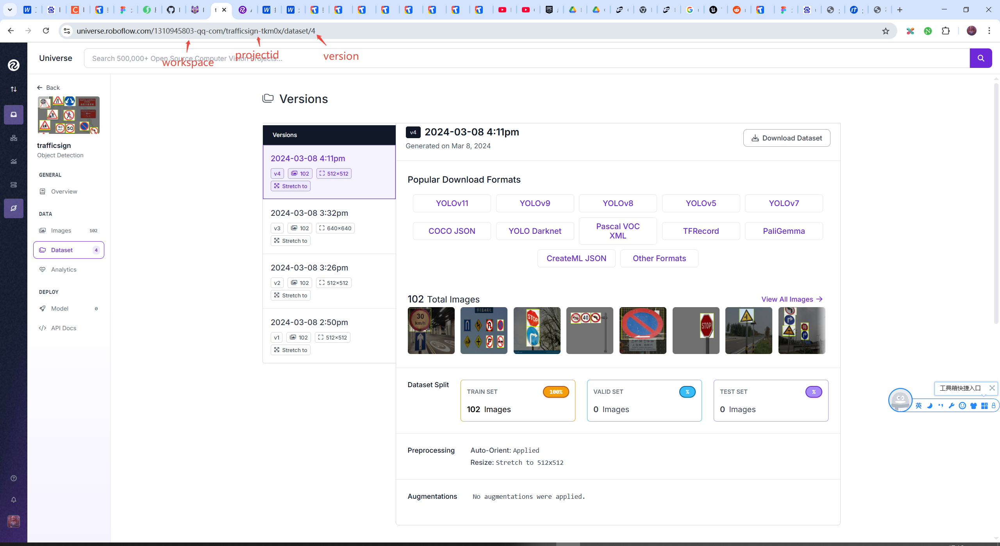
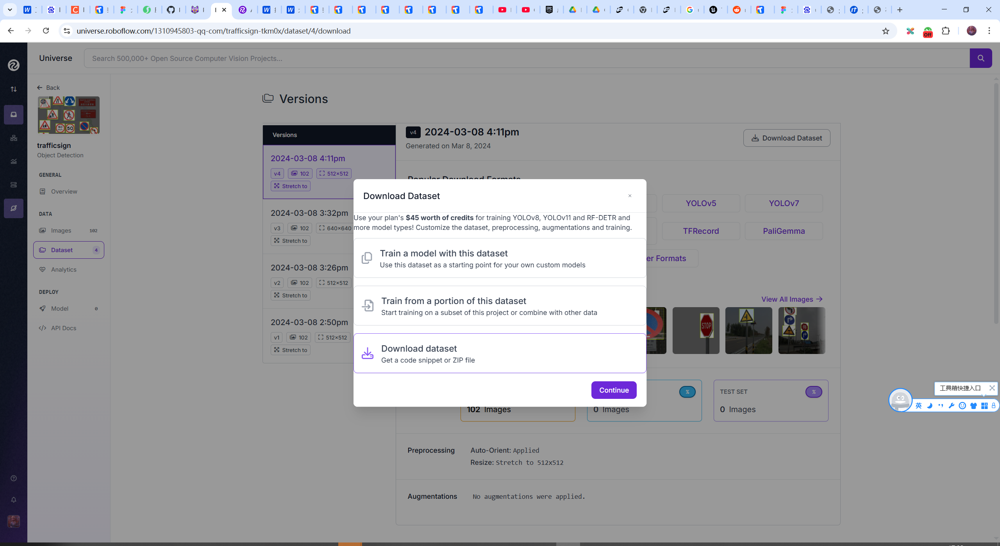
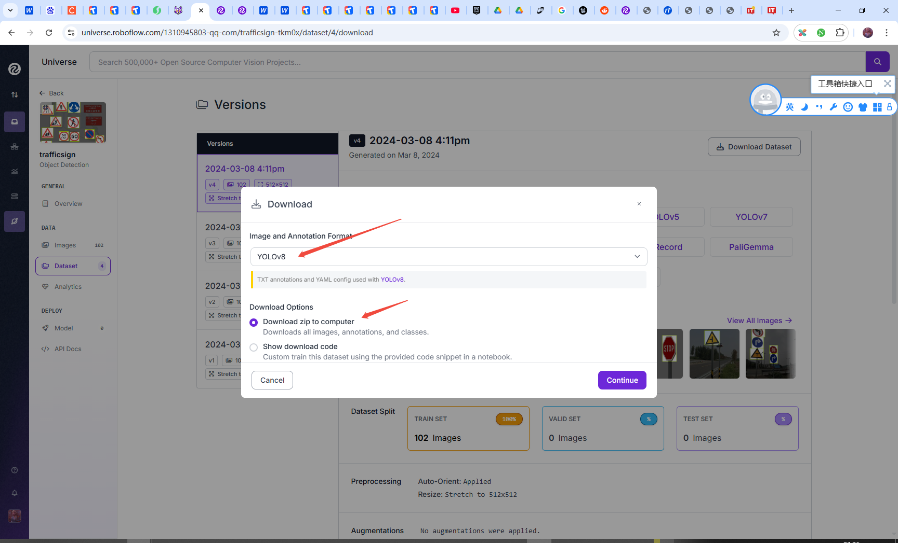
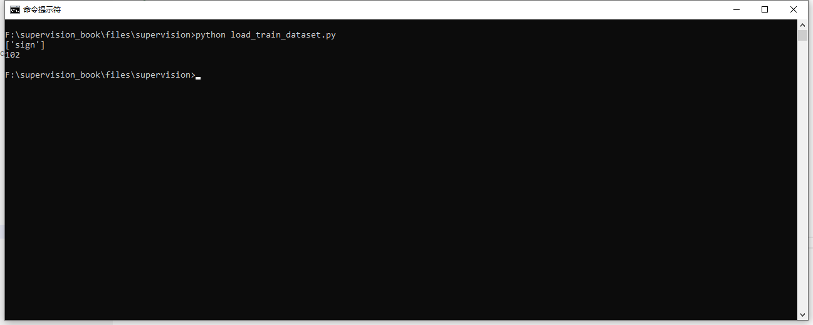
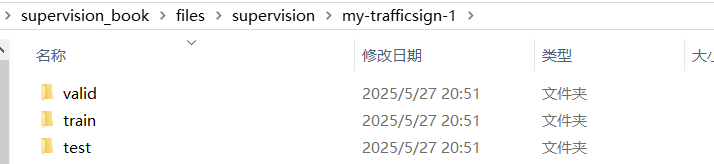
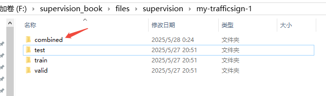
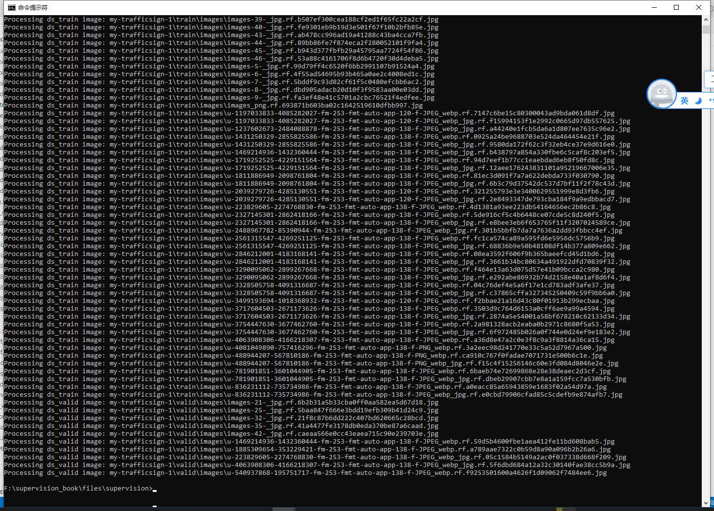
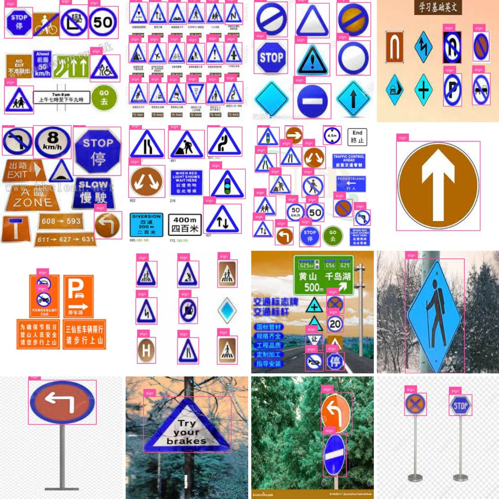
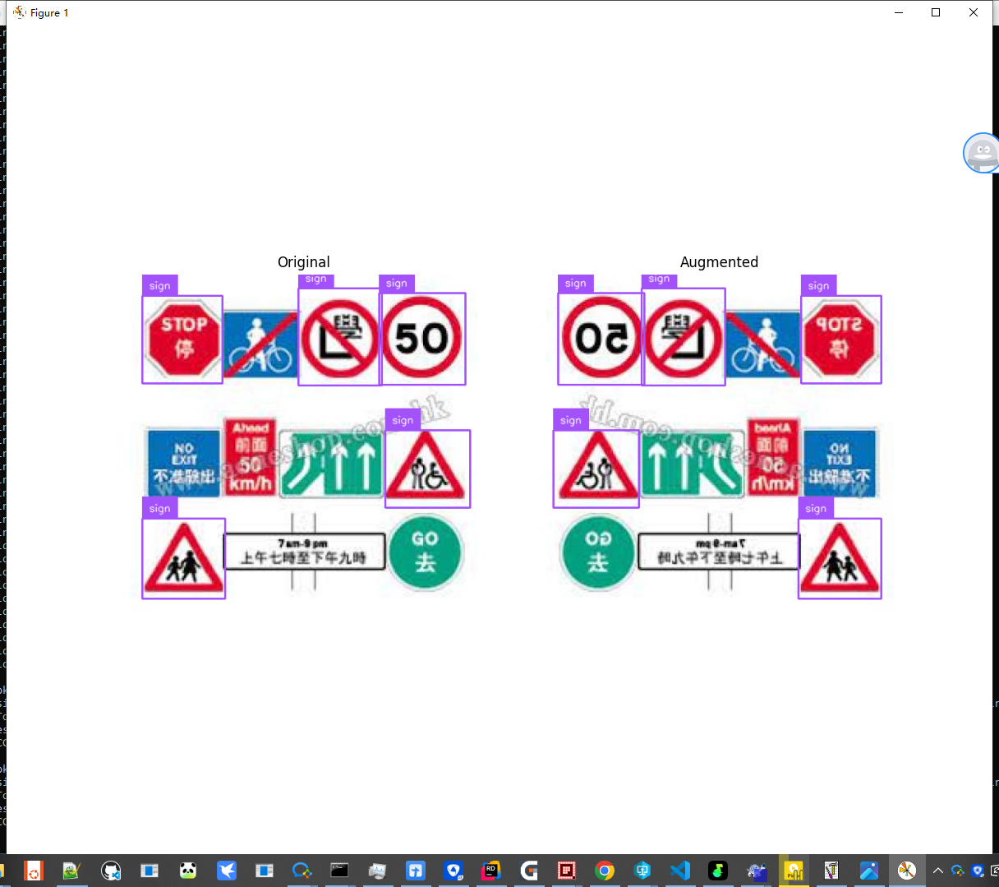

## 处理数据集

官网文档：`https://supervision.roboflow.com/latest/how_to/process_datasets/`

数据集(DataSet)，就是别人处理好的图片以及注释。

例如要训练一个交通标志识别的模型，那么首先要收集多张带交通标志的场景图片，然后框出这些交通标志，记录框的坐标宽高，以及类型数据保存到对应的文本中，然后将图片和数据文本分别存储到对应文件夹。

可以在roboflow下载别人整理好的数据集：`https://universe.roboflow.com/`

下面是从roboflow下载的一个交通标志的数据集结构：


一般来说，一个数据集会有三部分：
1. 训练集（Train Set）：训练模型参数​​（学习数据规律）。
2. 验证集（Validation Set）​：调参和模型选择​​（避免过拟合，优化超参数）。
3. 测试集（Test Set）​：最终性能评估​​（模拟真实场景，仅用一次）。

不过下载的交通标志数据集只有一个训练集，这也是正常的事情，因为可以自己从训练集复制出来验证集、测试集。

也可以将三个数据集合并成一个数据集。

本篇就来介绍如何对数据集进行操作。

### 下载数据集

从roboflow下载数据集有两种方式，第一种是直接从roboflow网页下载，第二种是用roboflow提供的python命令来下载。

两种方式都需要登录roboflow，所以自己先登录roboflow，用google、github、email都可以。

下面分别介绍两种下载方式，下载`https://universe.roboflow.com/1310945803-qq-com/trafficsign-tkm0x/dataset/4/download` 这个网址的交通标志数据集。

#### 1. 使用Python命令下载

先安装依赖库：

```python
pip install roboflow
```

然后就可以下载了。

```python
#file:files\supervision\download_dataset_from_roboflow.py

import roboflow

roboflow.login()

rf = roboflow.Roboflow()
project = rf.workspace('1310945803-qq-com').project('trafficsign-tkm0x')
dataset = project.version('4').download("yolov8")
```

代码里就指定从`1310945803-qq-com`这个workspace，下载了`trafficsign-tkm0x`这个项目的数据集。

下载数据集的version是`4`，然后下载的格式是`yolov8`。

这几个参数都可以从数据集的网址中找到，如下图：



下载好后的数据集文件夹结构如下图：


#### 2. 网页下载

直接打开网址`https://universe.roboflow.com/1310945803-qq-com/trafficsign-tkm0x/dataset/4/download`，点击右侧的`Download Dataset`按钮即可下载。



然后下一步需要选择`yolov8` 以zip形式下载。



下载好之后，解压出来就和上面命令下载的一致了。

### 加载数据集

SuperVision提供了接口，加载数据集，例如下面代码加载了上面下载的交通标志的数据集。

因为这个交通标志数据集只有`训练集（Train Set）`，所以这里代码也只加载了`训练集（Train Set）`。

```python
#file:files\supervision\load_train_dataset.py

import supervision as sv

ds_train = sv.DetectionDataset.from_yolo(
    images_directory_path=f'./trafficsign-4/train/images',
    annotations_directory_path=f'./trafficsign-4/train/labels',
    data_yaml_path=f'./trafficsign-4/data.yaml'
)

print(ds_train.classes)
print(len(ds_train)) #输出训练集的样本数量，即图片数量
```



### 拆分数据集

上面下载的交通标志数据集只有`训练集（Train Set）`，没有`验证集（Validation Set）`  `测试集（Test Set）`。

实际上验证集、测试集，它们和训练集是一样的内容，都是由图片样本和标注组成的，结构一模一样，甚至内容都可以一模一样。

所以可以将训练集拆分，例如留80%作为训练集，其他的作为验证集和测试集。

SuperVision也提供了拆分数据集的方法。

```python
#file:files\supervision\split_dataset.py

import supervision as sv

ds = sv.DetectionDataset.from_yolo(
    images_directory_path=f'./trafficsign-4/train/images',
    annotations_directory_path=f'./trafficsign-4/train/labels',
    data_yaml_path=f'./trafficsign-4/data.yaml'
)

ds_train, ds = ds.split(split_ratio=0.8, shuffle=True)
ds_valid, ds_test = ds.split(split_ratio=0.5, shuffle=True)

print(len(ds_train), len(ds_valid), len(ds_test))

# Save the datasets to disk
ds_train.as_yolo(
    images_directory_path='./my-trafficsign-1/train/images',
    annotations_directory_path='./my-trafficsign-1/train/labels',
    data_yaml_path='./my-trafficsign-1/train/data.yaml'
)
ds_valid.as_yolo(
    images_directory_path='./my-trafficsign-1/valid/images',
    annotations_directory_path='./my-trafficsign-1/valid/labels',
    data_yaml_path='./my-trafficsign-1/valid/data.yaml'
)
ds_test.as_yolo(
    images_directory_path='./my-trafficsign-1/test/images',
    annotations_directory_path='./my-trafficsign-1/test/labels',
    data_yaml_path='./my-trafficsign-1/test/data.yaml'
)
```

拆分后的数据集，被分为标准的三个数据集。




### 合并数据集

也可以将多个数据集，合并为一个数据集。

例如下面代码将上面拆分出来的，标准的三个数据集，又合并成了一个数据集。

```python
#file:files\supervision\merge_dataset.py

import supervision as sv

ds_train = sv.DetectionDataset.from_yolo(
    images_directory_path=f'./my-trafficsign-1/train/images',
    annotations_directory_path=f'./my-trafficsign-1/train/labels',
    data_yaml_path=f'./my-trafficsign-1/train/data.yaml'
)
ds_valid = sv.DetectionDataset.from_yolo(
    images_directory_path=f'./my-trafficsign-1/valid/images',
    annotations_directory_path=f'./my-trafficsign-1/valid/labels',
    data_yaml_path=f'./my-trafficsign-1/valid/data.yaml'
)
ds_test = sv.DetectionDataset.from_yolo(
    images_directory_path=f'./my-trafficsign-1/test/images',
    annotations_directory_path=f'./my-trafficsign-1/test/labels',
    data_yaml_path=f'./my-trafficsign-1/test/data.yaml'
)

print(ds_train.classes)
print(len(ds_train), len(ds_valid), len(ds_test))

# 合并数据集
ds_combine = sv.DetectionDataset.merge([ds_train, ds_valid, ds_test])
# 保存合并后的数据集
ds_combine.as_yolo(
    images_directory_path='./my-trafficsign-1/combined/images',
    annotations_directory_path='./my-trafficsign-1/combined/labels',
    data_yaml_path='./my-trafficsign-1/combined/data.yaml'
)
```



### 遍历数据集

```python
ds_train = sv.DetectionDataset.from_yolo(
    images_directory_path=f'./my-trafficsign-1/train/images',
    annotations_directory_path=f'./my-trafficsign-1/train/labels',
    data_yaml_path=f'./my-trafficsign-1/train/data.yaml'
)
```
这段代码加载的数据集，返回的`ds_train`，它其实是一个样本数组。

数组中的每个元素，就是一个样本。

每个样本存储这图片路径、图片、标注的坐标和宽高信息。

可以遍历`ds_train`。

```python
#file:files\supervision\iter_dataset.py

import supervision as sv

ds_train = sv.DetectionDataset.from_yolo(
    images_directory_path=f'./my-trafficsign-1/train/images',
    annotations_directory_path=f'./my-trafficsign-1/train/labels',
    data_yaml_path=f'./my-trafficsign-1/train/data.yaml'
)
ds_valid = sv.DetectionDataset.from_yolo(
    images_directory_path=f'./my-trafficsign-1/valid/images',
    annotations_directory_path=f'./my-trafficsign-1/valid/labels',
    data_yaml_path=f'./my-trafficsign-1/valid/data.yaml'
)
ds_test = sv.DetectionDataset.from_yolo(
    images_directory_path=f'./my-trafficsign-1/test/images',
    annotations_directory_path=f'./my-trafficsign-1/test/labels',
    data_yaml_path=f'./my-trafficsign-1/test/data.yaml'
)

# 遍历方式1
for image_path, image, annotations in ds_train:
    print(f"Processing ds_train image: {image_path}")

# 遍历方式2
for idx in range(len(ds_valid)):
    image_path, image, annotations = ds_valid[idx]
    print(f"Processing ds_valid image: {image_path}")
```



### 预览数据集

因为数据集是图片样本和标注的组合，就是说数据集是包含了图片，以及图片上目标所在区域的坐标以及宽高，所以我们可以显示图片，然后根据坐标宽高来画框，来预览数据集。

这样可以检查数据集是否正确。

如果数据集都错了，那么训练出来的模型肯定是错的。

```python
#file:files\supervision\visualize_dataset.py

import supervision as sv
import matplotlib.pyplot as plt

ds_train = sv.DetectionDataset.from_yolo(
    images_directory_path=f'./my-trafficsign-1/train/images',
    annotations_directory_path=f'./my-trafficsign-1/train/labels',
    data_yaml_path=f'./my-trafficsign-1/train/data.yaml'
)

box_annotator = sv.BoxAnnotator()
label_annotator = sv.LabelAnnotator()

annotated_images = []
for i in range(16):
    image_path, image, annotations = ds_train[i] # 获取第 i 张图片和对应的注释(annotations)
    print(f"i: {i}, image_path: {image_path}, annotations: {annotations}")

    labels = [ds_train.classes[class_id] for class_id in annotations.class_id]

    annotated_image = image.copy()
    annotated_image = box_annotator.annotate(annotated_image, annotations)
    annotated_image = label_annotator.annotate(annotated_image, annotations, labels)
    annotated_images.append(annotated_image)

print(f"Total annotated images: {len(annotated_images)}")

# 创建一个4x4的网格来展示16张图片
grid = sv.create_tiles(
    annotated_images,
    grid_size=(4, 4),
    single_tile_size=(400, 400),
    tile_padding_color=sv.Color.WHITE,
    tile_margin_color=sv.Color.WHITE
)

plt.imshow(grid)
plt.axis('off')
plt.savefig(
    './visualize_dataset.jpg',         # 文件名（支持.png/.jpg/.pdf等格式）
    dpi=300,                       # 分辨率（默认100）
    bbox_inches='tight',           # 去除多余白边
    pad_inches=0                  # 内边距控制
)
plt.show()
```



### 保存数据集

其实上面在拆分数据集、合并数据集的时候就已经保存了数据集。

下面的代码保存合并后的数据集。

```python
# 保存合并后的数据集
ds_combine.as_yolo(
    images_directory_path='./my-trafficsign-1/combined/images',
    annotations_directory_path='./my-trafficsign-1/combined/labels',
    data_yaml_path='./my-trafficsign-1/combined/data.yaml'
)
```

### 扩充数据集

当要训练一个模型时，可能你手里的图片样本不是很多，我们可以将图片样本，进行一些旋转、翻转、调高对比度等操作，来得到新的图片样本。

这其实也是一个很符合常理的操作，例如交通标志数据集，在日常开车时，因为天气的不同，相机能拍到的交通标志，也是有不同的明暗度、对比度的。

我们借助`augmentation`库来对图片进行变换。

```python
pip install augmentation
```

```python
#file:files\supervision\augment_dataset.py

# 1. 定义增强操作（前置步骤）
import albumentations as A

augmentation = A.Compose([
    A.Perspective(p=0.1),
    A.HorizontalFlip(p=1.0),
    A.RandomBrightnessContrast(p=0.5)
], bbox_params=A.BboxParams(format="pascal_voc", label_fields=["category"]))

# 2. 应用增强到单张图像（你提供的代码）
import numpy as np
import supervision as sv
from dataclasses import replace

# 加载数据
ds_train = sv.DetectionDataset.from_yolo(
    images_directory_path=f'./my-trafficsign-1/train/images',
    annotations_directory_path=f'./my-trafficsign-1/train/labels',
    data_yaml_path=f'./my-trafficsign-1/train/data.yaml'
)
_, image, annotations = ds_train[0]

# 调用增强操作
output = augmentation(
    image=image,
    bboxes=annotations.xyxy,
    category=annotations.class_id
)

# 提取增强结果
augmented_image = output["image"]
augmented_bboxes = np.array(output["bboxes"])
augmented_class_ids = np.array(output["category"])

# 更新标注
augmented_annotations = replace(
    annotations,
    xyxy=augmented_bboxes,
    class_id=augmented_class_ids
)

# 定义标注工具
box_annotator = sv.BoxAnnotator()
label_annotator = sv.LabelAnnotator()

# 原始图像标注
original_labels = [ds_train.classes[class_id] for class_id in annotations.class_id]
original_annotated = box_annotator.annotate(image.copy(), annotations)
original_annotated = label_annotator.annotate(original_annotated, annotations, original_labels)

# 增强后图像标注
augmented_labels = [ds_train.classes[class_id] for class_id in augmented_class_ids]
augmented_annotated = box_annotator.annotate(augmented_image.copy(), augmented_annotations)
augmented_annotated = label_annotator.annotate(augmented_annotated, augmented_annotations, augmented_labels)

# 对比显示
sv.plot_images_grid(
    [original_annotated, augmented_annotated],
    grid_size=(1, 2),
    titles=["Original", "Augmented"]
)
```

上面代码将样本图片左右镜像，然后将标注进行修正，得到了新的样本图片。

