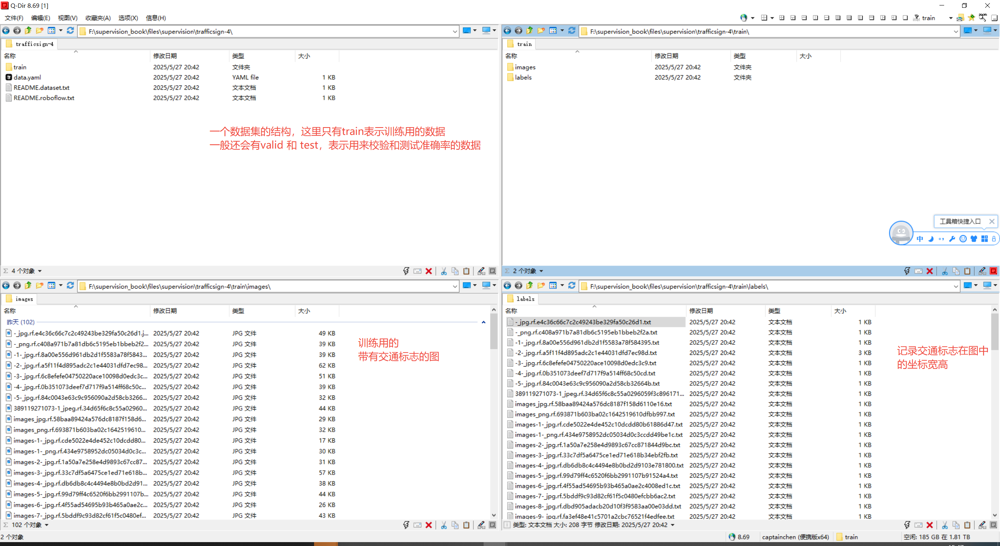

## 处理数据集

官网文档：`https://supervision.roboflow.com/latest/how_to/process_datasets/`

数据集(DataSet)，就是别人处理好的图片以及注释。

例如要训练一个交通标志识别的模型，那么首先要收集多张带交通标志的场景图片，然后框出这些交通标志，记录框的坐标宽高，以及类型数据保存到对应的文本中，然后将图片和数据文本分别存储到对应文件夹。

可以在roboflow下载别人整理好的数据集：`https://universe.roboflow.com/`

下面是从roboflow下载的一个交通标志的数据集结构：

一般来说，一个数据集会有三部分：
1. 训练集（Train Set）：训练模型参数​​（学习数据规律）。
2. 验证集（Validation Set）​：调参和模型选择​​（避免过拟合，优化超参数）。
3. 测试集（Test Set）​：最终性能评估​​（模拟真实场景，仅用一次）。

不过下载的交通标志数据集只有一个训练集，这也是正常的事情，因为可以自己从训练集复制出来验证集、测试集。

也可以将三个数据集合并成一个数据集。

本篇就来介绍如何对数据集进行操作。

