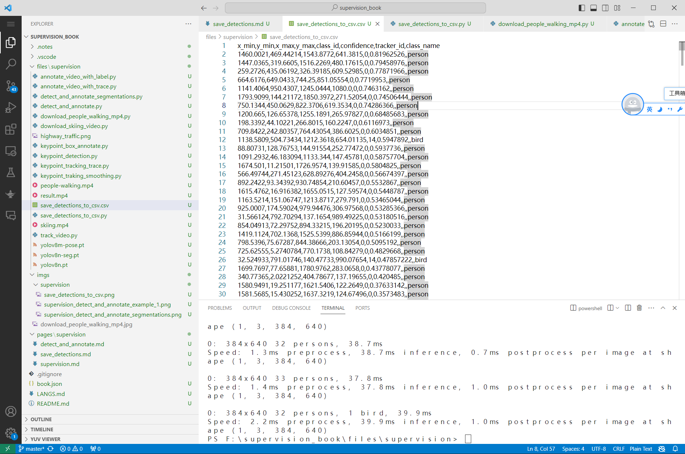

## 导出检测结果

可以导出物体检测结果到csv、json、自定义结构。

官方文档 `https://supervision.roboflow.com/latest/how_to/save_detections/`

### 准备视频

先下载测试视频。

```python
#file:files\supervision\download_people_walking_mp4.py

from supervision.assets import download_assets, VideoAssets

download_assets(VideoAssets.PEOPLE_WALKING)
```

### 导出到csv

```python
import supervision as sv
from ultralytics import YOLO

model = YOLO("yolov8n.pt")
frames_generator = sv.get_video_frames_generator("people-walking.mp4")

with sv.CSVSink("./save_detactions_to_csv.csv") as sink:
    for frame in frames_generator:

        results = model(frame)[0]
        detections = sv.Detections.from_ultralytics(results)
        sink.append(detections, {})
```

执行后就会将检测结果输出到`./save_detactions_to_csv.csv`，如下图：



### 导出到Json

### 导出自定义列