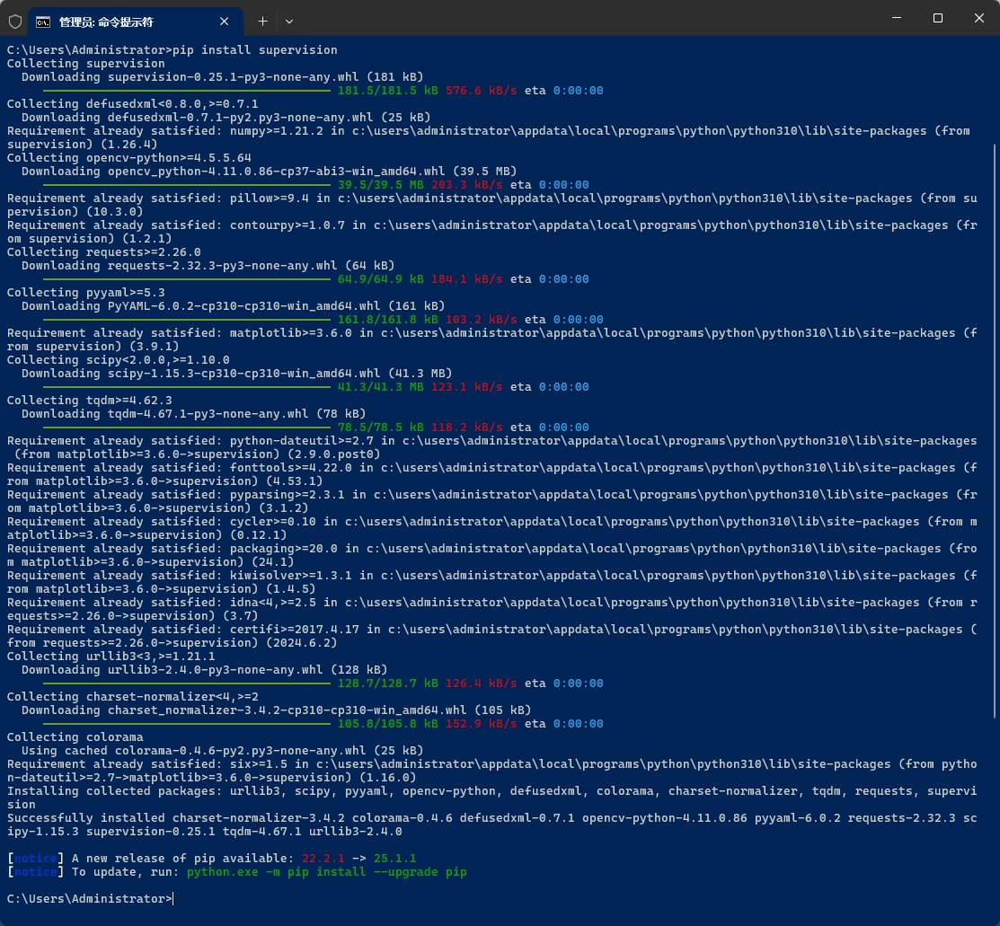

## SuperVision介绍

SuperVision是对Yolo等图像识别库的一个封装，另加了标注功能。

它利用Yolo等图像识别库返回的识别到的物体坐标、大小信息，在图像上给物体加上线框、Label、轨迹等标注。

后续代码都使用Yolo。

<video src="https://media.roboflow.com/traffic_analysis_result.mp4" controls width="80%"></video>

### 安装开发环境

Github地址：`https://github.com/roboflow/supervision`

官方文档：`https://supervision.roboflow.com/latest/#hello`

首先需要Python3.8或以上版本。

然后使用下面命令安装SuperVision:

```bash
pip install supervision
```



另外还需要安装YOLO模型库。

```bash
pip install ultralytics
```

```log
C:\Users\Administrator>pip install ultralytics
Collecting ultralytics
  Downloading ultralytics-8.3.137-py3-none-any.whl (1.0 MB)
     ━━━━━━━━━━━━━━━━━━━━━━━━━━━━━━━━━━━━━━━━ 1.0/1.0 MB 197.4 kB/s eta 0:00:00
Requirement already satisfied: tqdm>=4.64.0 in c:\users\administrator\appdata\local\programs\python\python310\lib\site-packages (from ultralytics) (4.67.1)
Requirement already satisfied: requests>=2.23.0 in c:\users\administrator\appdata\local\programs\python\python310\lib\site-packages (from ultralytics) (2.32.3)
Collecting torch!=2.4.0,>=1.8.0
  Downloading torch-2.7.0-cp310-cp310-win_amd64.whl (212.5 MB)
     ━━━━━━━━━━━━━━━━━━━━━━━━━━━━━━━━━━━━━━━━ 212.5/212.5 MB 120.1 kB/s eta 0:00:00
Requirement already satisfied: pyyaml>=5.3.1 in c:\users\administrator\appdata\local\programs\python\python310\lib\site-packages (from ultralytics) (6.0.2)
Requirement already satisfied: numpy>=1.23.0 in c:\users\administrator\appdata\local\programs\python\python310\lib\site-packages (from ultralytics) (1.26.4)
WARNING: Retrying (Retry(total=4, connect=None, read=None, redirect=None, status=None)) after connection broken by 'ProtocolError('Connection aborted.', RemoteDisconnected('Remote end closed connection without response'))': /simple/py-cpuinfo/
Collecting py-cpuinfo
  Downloading py_cpuinfo-9.0.0-py3-none-any.whl (22 kB)
Requirement already satisfied: pandas>=1.1.4 in c:\users\administrator\appdata\local\programs\python\python310\lib\site-packages (from ultralytics) (2.2.2)
Requirement already satisfied: matplotlib>=3.3.0 in c:\users\administrator\appdata\local\programs\python\python310\lib\site-packages (from ultralytics) (3.9.1)
Collecting psutil
  Downloading psutil-7.0.0-cp37-abi3-win_amd64.whl (244 kB)
     ━━━━━━━━━━━━━━━━━━━━━━━━━━━━━━━━━━━━━━━━ 244.9/244.9 kB 108.8 kB/s eta 0:00:00
Requirement already satisfied: scipy>=1.4.1 in c:\users\administrator\appdata\local\programs\python\python310\lib\site-packages (from ultralytics) (1.15.3)
Collecting ultralytics-thop>=2.0.0
  Downloading ultralytics_thop-2.0.14-py3-none-any.whl (26 kB)
Requirement already satisfied: pillow>=7.1.2 in c:\users\administrator\appdata\local\programs\python\python310\lib\site-packages (from ultralytics) (10.3.0)
Requirement already satisfied: opencv-python>=4.6.0 in c:\users\administrator\appdata\local\programs\python\python310\lib\site-packages (from ultralytics) (4.11.0.86)
Collecting torchvision>=0.9.0
  Downloading torchvision-0.22.0-cp310-cp310-win_amd64.whl (1.7 MB)
     ━━━━━━━━━━━━━━━━━━━━━━━━━━━━━━━━━━━━━━━━ 1.7/1.7 MB 121.6 kB/s eta 0:00:00
Requirement already satisfied: contourpy>=1.0.1 in c:\users\administrator\appdata\local\programs\python\python310\lib\site-packages (from matplotlib>=3.3.0->ultralytics) (1.2.1)
Requirement already satisfied: packaging>=20.0 in c:\users\administrator\appdata\local\programs\python\python310\lib\site-packages (from matplotlib>=3.3.0->ultralytics) (24.1)
Requirement already satisfied: cycler>=0.10 in c:\users\administrator\appdata\local\programs\python\python310\lib\site-packages (from matplotlib>=3.3.0->ultralytics) (0.12.1)
Requirement already satisfied: fonttools>=4.22.0 in c:\users\administrator\appdata\local\programs\python\python310\lib\site-packages (from matplotlib>=3.3.0->ultralytics) (4.53.1)
Requirement already satisfied: python-dateutil>=2.7 in c:\users\administrator\appdata\local\programs\python\python310\lib\site-packages (from matplotlib>=3.3.0->ultralytics) (2.9.0.post0)
Requirement already satisfied: kiwisolver>=1.3.1 in c:\users\administrator\appdata\local\programs\python\python310\lib\site-packages (from matplotlib>=3.3.0->ultralytics) (1.4.5)
Requirement already satisfied: pyparsing>=2.3.1 in c:\users\administrator\appdata\local\programs\python\python310\lib\site-packages (from matplotlib>=3.3.0->ultralytics) (3.1.2)
Requirement already satisfied: pytz>=2020.1 in c:\users\administrator\appdata\local\programs\python\python310\lib\site-packages (from pandas>=1.1.4->ultralytics) (2024.1)
Requirement already satisfied: tzdata>=2022.7 in c:\users\administrator\appdata\local\programs\python\python310\lib\site-packages (from pandas>=1.1.4->ultralytics) (2024.1)
Requirement already satisfied: idna<4,>=2.5 in c:\users\administrator\appdata\local\programs\python\python310\lib\site-packages (from requests>=2.23.0->ultralytics) (3.7)
Requirement already satisfied: urllib3<3,>=1.21.1 in c:\users\administrator\appdata\local\programs\python\python310\lib\site-packages (from requests>=2.23.0->ultralytics) (2.4.0)
Requirement already satisfied: charset-normalizer<4,>=2 in c:\users\administrator\appdata\local\programs\python\python310\lib\site-packages (from requests>=2.23.0->ultralytics) (3.4.2)
Requirement already satisfied: certifi>=2017.4.17 in c:\users\administrator\appdata\local\programs\python\python310\lib\site-packages (from requests>=2.23.0->ultralytics) (2024.6.2)
Requirement already satisfied: typing-extensions>=4.10.0 in c:\users\administrator\appdata\local\programs\python\python310\lib\site-packages (from torch!=2.4.0,>=1.8.0->ultralytics) (4.12.2)
Collecting sympy>=1.13.3
  Downloading sympy-1.14.0-py3-none-any.whl (6.3 MB)
     ━━━━━━━━━━━━━━━━━━━━━━━━━━━━━━━━━━━━━━━━ 6.3/6.3 MB 181.6 kB/s eta 0:00:00
Requirement already satisfied: networkx in c:\users\administrator\appdata\local\programs\python\python310\lib\site-packages (from torch!=2.4.0,>=1.8.0->ultralytics) (3.3)
Collecting jinja2
  Downloading jinja2-3.1.6-py3-none-any.whl (134 kB)
     ━━━━━━━━━━━━━━━━━━━━━━━━━━━━━━━━━━━━━━━━ 134.9/134.9 kB 83.1 kB/s eta 0:00:00
Collecting fsspec
  Downloading fsspec-2025.3.2-py3-none-any.whl (194 kB)
     ━━━━━━━━━━━━━━━━━━━━━━━━━━━━━━━━━━━━━━━━ 194.4/194.4 kB 113.3 kB/s eta 0:00:00
Collecting filelock
  Downloading filelock-3.18.0-py3-none-any.whl (16 kB)
Requirement already satisfied: colorama in c:\users\administrator\appdata\local\programs\python\python310\lib\site-packages (from tqdm>=4.64.0->ultralytics) (0.4.6)
Requirement already satisfied: six>=1.5 in c:\users\administrator\appdata\local\programs\python\python310\lib\site-packages (from python-dateutil>=2.7->matplotlib>=3.3.0->ultralytics) (1.16.0)
Collecting mpmath<1.4,>=1.1.0
  Downloading mpmath-1.3.0-py3-none-any.whl (536 kB)
     ━━━━━━━━━━━━━━━━━━━━━━━━━━━━━━━━━━━━━━━━ 536.2/536.2 kB 168.3 kB/s eta 0:00:00
Collecting MarkupSafe>=2.0
  Downloading MarkupSafe-3.0.2-cp310-cp310-win_amd64.whl (15 kB)
Installing collected packages: py-cpuinfo, mpmath, sympy, psutil, MarkupSafe, fsspec, filelock, jinja2, torch, ultralytics-thop, torchvision, ultralytics
Successfully installed MarkupSafe-3.0.2 filelock-3.18.0 fsspec-2025.3.2 jinja2-3.1.6 mpmath-1.3.0 psutil-7.0.0 py-cpuinfo-9.0.0 sympy-1.14.0 torch-2.7.0 torchvision-0.22.0 ultralytics-8.3.137 ultralytics-thop-2.0.14

[notice] A new release of pip available: 22.2.1 -> 25.1.1
[notice] To update, run: python.exe -m pip install --upgrade pip

C:\Users\Administrator>
```

这样就可以使用supervision了。

