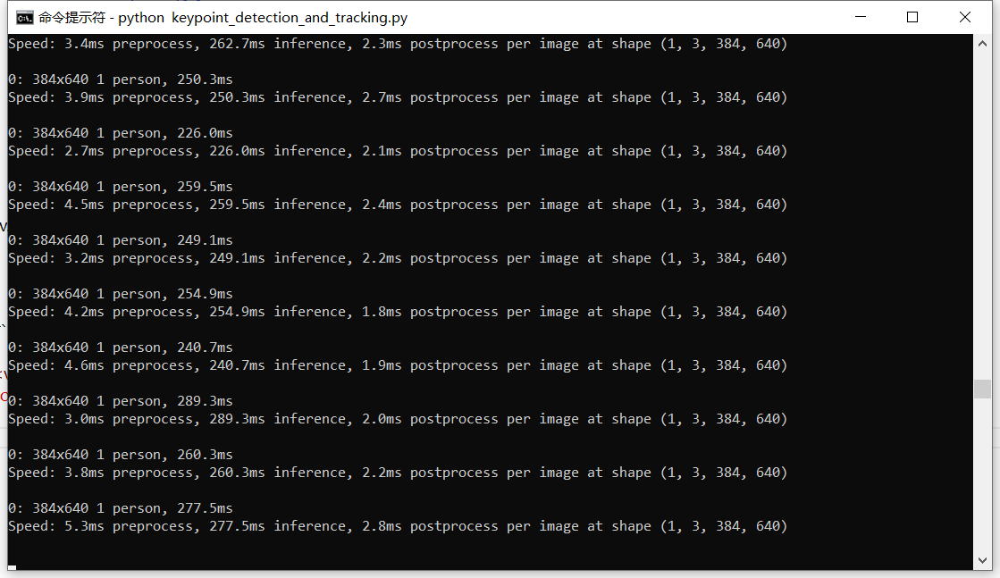
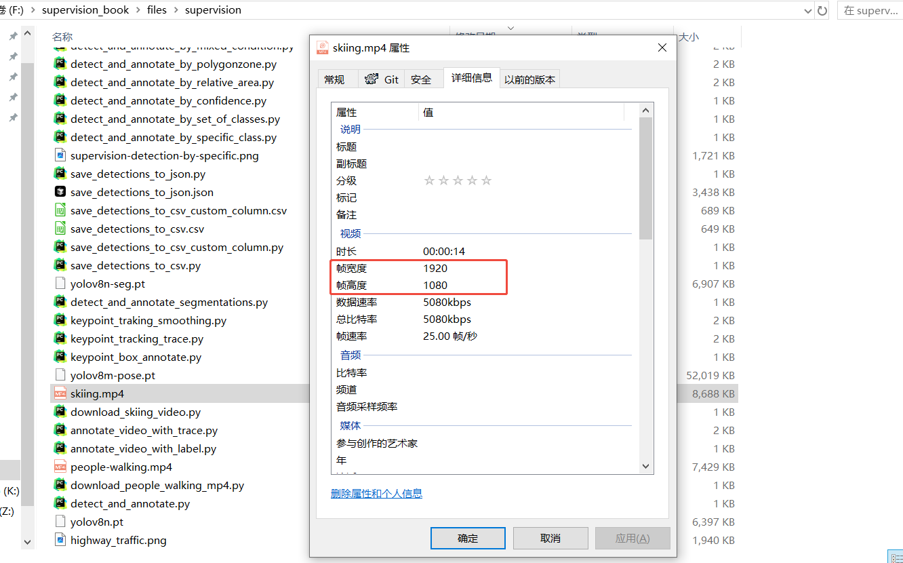

## 追踪视频中的对象

SuperVision可以将视频展开为一帧一帧的图片，然后对每帧图片进行推理，添加标注，然后再合并为视频。

先下载测试视频：

```python
#file:files\supervision\download_people_walking_mp4.py

from supervision.assets import download_assets, VideoAssets

download_assets(VideoAssets.PEOPLE_WALKING)
```

<video src="https://media.roboflow.com/supervision/video-examples/people-walking.mp4" controls width="80%"></video>

### 标注视频人物

对视频中的人物进行标注

```python
#file: files\supervision\detect_video_objects.py

## 给检测到的对象添加方框

import numpy as np
import supervision as sv
from ultralytics import YOLO

model = YOLO("yolov8n.pt")
box_annotator = sv.BoundingBoxAnnotator()

# 使用YOLOv8模型检测每一帧图片中的对象，并在每个检测到的对象周围添加方框。
def callback(frame: np.ndarray, _: int) -> np.ndarray:
    results = model(frame)[0]
    detections = sv.Detections.from_ultralytics(results)
    return box_annotator.annotate(frame.copy(), detections=detections)

# 将视频拆分为一帧一帧的图片，调用callback函数处理每一帧，然后合成视频。
sv.process_video(
    source_path="people-walking.mp4",
    target_path="detect_video_objects.mp4",
    callback=callback
)
```

<video src="https://media.roboflow.com/supervision/video-examples/how-to/track-objects/run-inference.mp4" controls width="80%"></video>

### 识别并标注TrackingID

对视频中的人物进行识别，并使用`sv.ByteTrack`功能对每个识别的人物分配TrackingID，然后标注出来。

```python
#file:files\supervision\annotate_video_objects_with_tracking_id.py

## 给检测到的对象添加方框并显示Tracking ID，Tracking ID是一个唯一的标识符，用于跟踪视频中每个对象的运动轨迹。

import numpy as np
import supervision as sv
from ultralytics import YOLO

model = YOLO("yolov8n.pt")
tracker = sv.ByteTrack()
box_annotator = sv.BoundingBoxAnnotator()
label_annotator = sv.LabelAnnotator()

# 使用YOLOv8模型检测每一帧图片中的对象，并在每个检测到的对象周围添加方框。
def callback(frame: np.ndarray, _: int) -> np.ndarray:
    results = model(frame)[0]
    detections = sv.Detections.from_ultralytics(results)
    detections = tracker.update_with_detections(detections)# 更新检测结果以包含跟踪ID

    labels = [
        f"#{tracker_id} {results.names[class_id]}"
        for class_id, tracker_id
        in zip(detections.class_id, detections.tracker_id)
    ]

    annotated_frame = box_annotator.annotate(
        frame.copy(), detections=detections)
    return label_annotator.annotate(
        annotated_frame, detections=detections, labels=labels)#显示Tracking ID

# 将视频拆分为一帧一帧的图片，调用callback函数处理每一帧，然后合成视频。
sv.process_video(
    source_path="people-walking.mp4",
    target_path="annotate_video_objects_with_tracking_id.mp4",
    callback=callback
)
```

<video src="https://media.roboflow.com/supervision/video-examples/how-to/track-objects/annotate-video-with-tracking-ids.mp4" controls width="80%"></video>

### 绘制追踪轨迹线

上面用`sv.ByteTrack`给每个识别的人物添加了TrackingID，并且标注出来了。

接下来使用`sv.TraceAnnotator`来绘制人物运动轨迹线。

```python
#file:files\supervision\annotate_video_objects_with_traces.py

## 给检测到的对象添加方框并显示Tracking ID，并绘制视频中每个对象的运动轨迹。

import numpy as np
import supervision as sv
from ultralytics import YOLO

model = YOLO("yolov8n.pt")
tracker = sv.ByteTrack()
box_annotator = sv.BoundingBoxAnnotator()
label_annotator = sv.LabelAnnotator()
trace_annotator = sv.TraceAnnotator()

# 使用YOLOv8模型检测每一帧图片中的对象，并在每个检测到的对象周围添加方框。
def callback(frame: np.ndarray, _: int) -> np.ndarray:
    results = model(frame)[0]
    detections = sv.Detections.from_ultralytics(results)
    detections = tracker.update_with_detections(detections)# 更新检测结果以包含跟踪ID

    labels = [
        f"#{tracker_id} {results.names[class_id]}"
        for class_id, tracker_id
        in zip(detections.class_id, detections.tracker_id)
    ]

    annotated_frame = box_annotator.annotate(frame.copy(), detections=detections)
    annotated_frame = label_annotator.annotate(annotated_frame, detections=detections, labels=labels)#显示Tracking ID
    return trace_annotator.annotate(annotated_frame, detections=detections)

# 将视频拆分为一帧一帧的图片，调用callback函数处理每一帧，然后合成视频。
sv.process_video(
    source_path="people-walking.mp4",
    target_path="annotate_video_objects_with_traces.mp4",
    callback=callback
)
```

<video src="https://media.roboflow.com/supervision/video-examples/how-to/track-objects/annotate-video-with-traces.mp4" controls width="80%"></video>


### 人物骨骼识别追踪

SuperVision可以利用`yolov8m-pose.pt`模型来识别人物Pose，然后绘制标注人体关节骨骼。

先下载滑雪视频：

```python
#file:files\supervision\download_skiing_video.py

## 下载滑雪视频

from supervision.assets import download_assets, VideoAssets

download_assets(VideoAssets.SKIING)
```

<video src="https://media.roboflow.com/supervision/video-examples/how-to/track-objects/skiing-hd.mp4" controls width="80%"></video>

下面使用`EdgeAnnotator` 和 `VertexAnnotator` 来绘制识别到的人体关节。

```python
#file:files\supervision\keypoint_detection.py

## 检测人物骨骼、关节点，并绘制骨架

import numpy as np
import supervision as sv
from ultralytics import YOLO

model = YOLO("yolov8m-pose.pt")
edge_annotator = sv.EdgeAnnotator() #边的标注器
vertex_annotator = sv.VertexAnnotator() #点的标注器

def callback(frame: np.ndarray, _: int) -> np.ndarray:
    results = model(frame)[0]
    key_points = sv.KeyPoints.from_ultralytics(results) #从YOLO获取识别到的关节点

    annotated_frame = edge_annotator.annotate(frame.copy(), key_points=key_points) #先绘制骨架
    return vertex_annotator.annotate(annotated_frame, key_points=key_points) #再绘制关节点

sv.process_video(
    source_path="skiing.mp4",
    target_path="keypoint_detection.mp4",
    callback=callback
)
```

<video src="https://media.roboflow.com/supervision/video-examples/how-to/track-objects/track-keypoints-only-keypoints.mp4" controls width="80%"></video>


### 用关节点生成Box范围

官方文档：`https://supervision.roboflow.com/latest/how_to/track_objects/#keypoint-detection`

上面利用`yolov8m-pose.pt`模型来识别人物Pose，并且拿到了关节点`key_points`，那么现在可以利用这些关节点数据生成包围盒。

```python
#file:files\supervision\keypoint_detection_box_annotator.py

## 检测人物骨骼、关节点，并绘制骨架

import numpy as np
import supervision as sv
from ultralytics import YOLO

model = YOLO("yolov8m-pose.pt")
edge_annotator = sv.EdgeAnnotator() #边的标注器
vertex_annotator = sv.VertexAnnotator() #点的标注器
box_annotator = sv.BoxAnnotator() #边框标注器

def callback(frame: np.ndarray, _: int) -> np.ndarray:
    results = model(frame)[0]
    key_points = sv.KeyPoints.from_ultralytics(results) #从YOLO获取识别到的关节点
    detections = key_points.as_detections() #将关节点转换为检测对象

    annotated_frame = edge_annotator.annotate(frame.copy(), key_points=key_points) #先绘制骨架
    annotated_frame = vertex_annotator.annotate(annotated_frame, key_points=key_points) #再绘制关节点
    return box_annotator.annotate(annotated_frame, detections=detections) # 绘制边框

sv.process_video(
    source_path="skiing.mp4",
    target_path="keypoint_detection_box_annotator.mp4",
    callback=callback
)
```

<video src="https://media.roboflow.com/supervision/video-examples/how-to/track-objects/track-keypoints-converted-to-detections.mp4" controls width="80%"></video>


### 绘制轨迹

在识别完关节点后，还可以追踪运动轨迹。

```python
#file:files\supervision\keypoint_detection_and_tracking.py

## 检测人物骨骼、关节点，并绘制骨架

import numpy as np
import supervision as sv
from ultralytics import YOLO

model = YOLO("yolov8m-pose.pt")
edge_annotator = sv.EdgeAnnotator() #边的标注器
vertex_annotator = sv.VertexAnnotator() #点的标注器
box_annotator = sv.BoxAnnotator() #边框标注器

tracker = sv.ByteTrack()
trace_annotator = sv.TraceAnnotator()

def callback(frame: np.ndarray, _: int) -> np.ndarray:
    results = model(frame)[0]
    key_points = sv.KeyPoints.from_ultralytics(results) #从YOLO获取识别到的关节点
    detections = key_points.as_detections() #将关节点转换为检测对象

    detections = tracker.update_with_detections(detections) #跟踪检测对象

    annotated_frame = edge_annotator.annotate(frame.copy(), key_points=key_points) #先绘制骨架
    annotated_frame = vertex_annotator.annotate(annotated_frame, key_points=key_points) #再绘制关节点
    annotated_frame = box_annotator.annotate(annotated_frame, detections=detections) # 绘制边框
    return trace_annotator.annotate(annotated_frame, detections=detections) # 绘制轨迹

sv.process_video(
    source_path="skiing.mp4",
    target_path="keypoint_detection_and_tracking.mp4",
    callback=callback
)
```

<video src="https://media.roboflow.com/supervision/video-examples/how-to/track-objects/track-keypoints-with-tracking.mp4" controls width="80%"></video>

### 平滑处理

上面检测了人物的骨骼关节点、使用Box进行标注、并且绘制了追踪曲线。

但是每一帧之间的关节点坐标变化较大，导致Box和追踪曲线不够平滑。

现在来添加平滑处理。

```python
#file:files\supervision\keypoint_detection_and_tracking_smoothing.py

import numpy as np
import supervision as sv
from ultralytics import YOLO

model = YOLO("yolov8m-pose.pt")
edge_annotator = sv.EdgeAnnotator() #边的标注器
vertex_annotator = sv.VertexAnnotator() #点的标注器
box_annotator = sv.BoxAnnotator() #边框标注器

tracker = sv.ByteTrack()
smoother = sv.DetectionsSmoother()#平滑器
trace_annotator = sv.TraceAnnotator()

def callback(frame: np.ndarray, _: int) -> np.ndarray:
    results = model(frame)[0]
    key_points = sv.KeyPoints.from_ultralytics(results) #从YOLO获取识别到的关节点
    detections = key_points.as_detections() #将关节点转换为检测对象
    detections = tracker.update_with_detections(detections) #跟踪检测对象

    detections = smoother.update_with_detections(detections) #平滑检测对象

    annotated_frame = edge_annotator.annotate(frame.copy(), key_points=key_points) #先绘制骨架
    annotated_frame = vertex_annotator.annotate(annotated_frame, key_points=key_points) #再绘制关节点
    annotated_frame = box_annotator.annotate(annotated_frame, detections=detections) # 绘制边框
    return trace_annotator.annotate(annotated_frame, detections=detections) # 绘制轨迹

sv.process_video(
    source_path="skiing.mp4",
    target_path="keypoint_detection_and_tracking_smoothing.mp4",
    callback=callback
)
```

<video src="https://media.roboflow.com/supervision/video-examples/how-to/track-objects/track-keypoints-with-smoothing.mp4" controls width="80%"></video>

### 关于性能



代码运行过程中，会打印出对每一帧图片的处理耗时。

```txt
0: 384x640 2 persons, 171.3ms
Speed: 1.5ms preprocess, 171.3ms inference, 1.4ms postprocess per image at shape (1, 3, 384, 640)
```

这是对一张图片进行处理打印出来的信息，下面分别来看。

第一行：

```txt
0: 384x640 2 persons, 171.3ms
```
表示将这一帧图片以`384x640`分辨率进行处理。

是的，YOLO并不会将图片以分辨率进行处理，而是以训练模型时的分辨率尺寸进行处理。

YOLO训练时使用了640的分辨率，那么在进行处理时，会将传入的图片宽高较大的那个缩放成640，然后保持宽高比。



实际上滑雪视频是1920x1080分辨率的，这里就进行了缩小到384x640。

然后YOLO识别到了图片上有`2 persons`，两个人。

识别耗时为`171.3ms`。

第二行：

```txt
Speed: 1.5ms preprocess, 171.3ms inference, 1.4ms postprocess per image at shape (1, 3, 384, 640)
```

`1.5ms preprocess` 表示预处理花了`1.5ms`。

`171.3ms inference` 表示模型接口(这里是YOLO)花了`171.3ms`。

`1.4ms postprocess per image at shape (1, 3, 384, 640)` 表示SuperVision对识别到的人物进行标注，花了`1.4ms`。